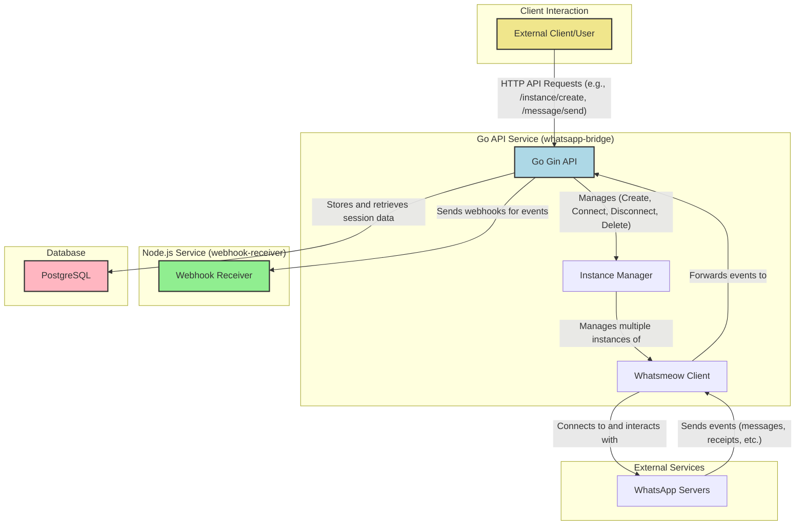

# Architecture

This document provides an overview of the system architecture for the Go WhatsApp Bridge.

## Overview

The system is composed of three main services orchestrated using Docker Compose:

1.  **Go WhatsApp Bridge (`whatsapp-bridge`)**: The core application responsible for managing WhatsApp instances, handling API requests, and sending webhooks.
2.  **Node.js Webhook Receiver (`webhook-receiver`)**: A simple Node.js service to receive and process webhooks sent from the Go application.
3.  **PostgreSQL Database (`postgres`)**: A PostgreSQL database to store session data for each WhatsApp instance, ensuring persistence.

## Architecture Diagram

The following diagram illustrates the interaction between the different components of the system.

## Component Descriptions

-   **Client**: Represents any external user or system that interacts with the Go WhatsApp Bridge through its HTTP API.
-   **Go Gin API**: The public-facing API of the `whatsapp-bridge` service. It exposes endpoints for instance management, message sending, and other functionalities.
-   **Instance Manager**: A component within the Go application that manages the lifecycle of all active WhatsApp instances.
-   **Whatsmeow Client**: The underlying library used to connect to and interact with the WhatsApp servers. Each instance has its own Whatsmeow client.
-   **PostgreSQL**: The database used to persist session information for each WhatsApp instance, allowing for reconnections without scanning the QR code again.
-   **Webhook Receiver**: A separate Node.js service that listens for incoming webhooks from the Go application. This service can be extended to process events, such as saving messages to a database or triggering other business logic.
-   **WhatsApp Servers**: The official WhatsApp servers that the Whatsmeow client communicates with.

## Data Flow

1.  A **Client** sends an HTTP request to the **Go API** (e.g., to create a new instance).
2.  The **Go API** uses the **Instance Manager** to create a new **Whatsmeow Client**.
3.  The **Whatsmeow Client** connects to the **WhatsApp Servers**. Session data is stored in the **PostgreSQL** database.
4.  When an event occurs (e.g., a new message is received), the **WhatsApp Servers** send the event to the **Whatsmeow Client**.
5.  The **Whatsmeow Client** forwards the event to the **Go API**.
6.  The **Go API** processes the event, and if it's a media file, it downloads it.
7.  Finally, the **Go API** sends a webhook with the event data to the **Node.js Webhook Receiver** for further processing.
